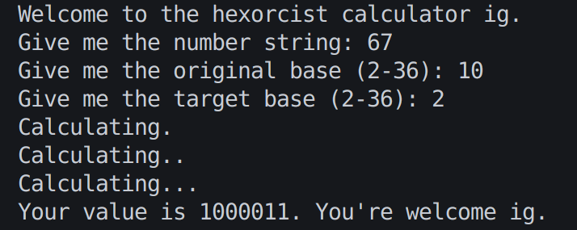

# Hexorcist Base Converter

Hexorcist is a simple Python-based calculator that converts numbers between different bases, from 2 up to 36. It supports both converting a number to decimal and converting a decimal number to any target base.

## Features
- Convert numbers from any base (2-36) to decimal.
- Convert decimal numbers to any base (2-36).
- Interactive command-line interface.
- Handles both uppercase and lowercase input for bases higher than 10.

## Installation
1. Make sure you have Python 3 installed.
2. Clone or download this repository.
3. Run the program from your terminal:

```bash
python hexorcist.py
```

## Usage

    Enter the number you want to convert.

    Enter the original base of the number (2-36).

    Enter the target base to convert to (2-36).

    The program will calculate and display the converted value.

## How to Test

1. Install pytest using `pip install pytest`
2. Type pytest into the terminal in the same working directory as calculator.py, and tests should run
3. To see individual tests run, use the pytest with the option `-v` like so: `pytest -v`


## Example:



## Notes

- Only bases between 2 and 36 are supported.
- Input is case-insensitive for letters in bases higher than 10.

